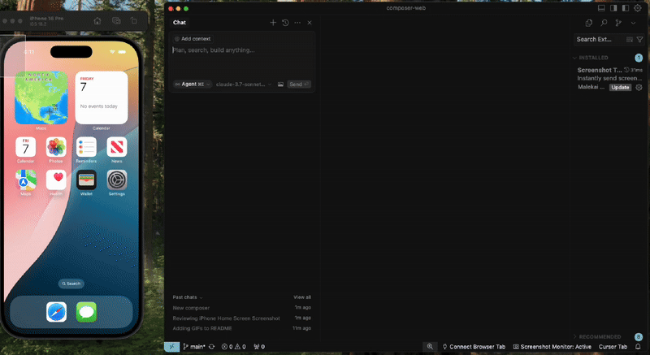
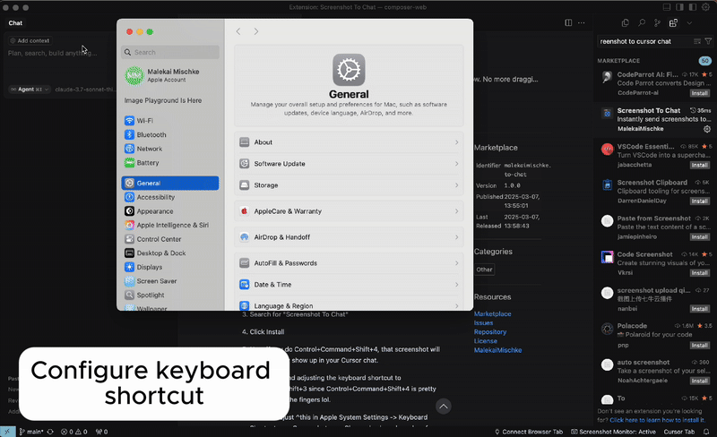

# Screenshot To Chat

Instantly send screenshots to your Cursor chat window. No more dragging screenshots from your desktop.



## System Requirements

- macOS (currently Mac-only)
- Node.js 18.0.0 or higher
- Cursor IDE with VS Code version 1.96.2 or higher
- Homebrew package manager


## Complete Setup Guide ([30-Second Setup Video Here](https://drive.google.com/file/d/1f8nye_u5weuz9o76d-w_7spoh65b3w8B/view?usp=sharing))

### 1. Install Required Tools

First, ensure you have all required tools installed:

1. **Install Homebrew** (if not already installed):
   - Visit [brew.sh](https://brew.sh)
   - Copy the installation command from their website
   - Open Terminal (press Cmd+Space, type "Terminal", press Enter)
   - Paste and run the command
   - Follow any additional instructions shown in Terminal

2. **Install pngpaste** (required for screenshot handling):
   ```bash
   brew install pngpaste
   ```

3. **Verify Node.js** version (should be 18.0.0 or higher):
   ```bash
   node --version
   ```
   If you need to install or update Node.js, visit [nodejs.org](https://nodejs.org)

### 2. Install the Extension

1. Open Cursor IDE
2. Open Extensions (Cmd+Shift+X)
3. Search for "Screenshot To Chat"
4. Click Install


## How to Use

### Taking Screenshots

1. Make sure Cursor chat is open
2. Use Control+Command+Shift+4 to capture a screenshot
3. The screenshot will automatically appear in your Cursor chat


### Customize Keyboard Shortcut (Recommended)

The default Control+Command+Shift+4 can be awkward. Here's how to change it to something more comfortable (like Command+Shift+3):



1. Open Apple System Settings
2. Go to Keyboard > Keyboard Shortcuts > Screenshots
3. Find "Copy picture of selected area to the clipboard"
4. Click the existing shortcut and press your preferred key combination


## Known Quirks

1. **Verify Installation**
   - Confirm pngpaste is installed: `which pngpaste` in terminal
   - If not found, run: `brew install pngpaste`

2. **Check Extension Status**
   - Open Extensions panel (Cmd+Shift+X)
   - Ensure "Screenshot To Chat" is enabled

3. **Common Fixes**
   - Restart Cursor
   - Clear the chat window if it already contains a screenshot
   - Ensure you're using the correct keyboard shortcut


## Known Limitations

- If chat already contains a screenshot, you'll need to clear it before taking a new one
- Currently Mac-only (Windows support planned for future)

## Found a Bug?

Please open an issue on our [GitHub repository](https://github.com/malekai-gauntlet/screenshot).

Special thanks to @saketsarin on GitHub for the helpful OS tools.